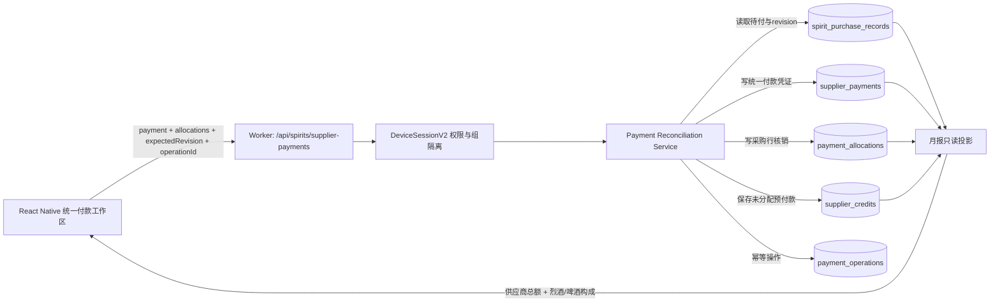

# 统一供货商付款与按行拆分核销：实施技术包

**范围：** 烈酒进销存内的烈酒与啤酒分类；统一供货商付款、按采购行核销、预付款、跨月对账、月结保护与总月报只读投影。  
**不在范围：** 将葡萄酒供应商并入烈酒供应商、用付款金额改写采购成本、按供应商名称猜测关联。

> 系统首先承认真实世界的付款：财务通常向一个供货商支付一笔总额。系统随后要求这笔总额被**明确核销到采购行**，因此可以同时做到统一付款和分类金额透明。

## 1. 后端财务对账服务架构



服务只接受 `supplierId`、`purchaseId`、金额最小单位整数、设备组、revision 与 `operationId`；拒绝单独以供应商名称、商品名称或分类名称作为写入依据。供应商统一付款是 `supplier_payments` 的一条凭证；每条核销是 `payment_allocations` 的一行；未分配金额转为 `supplier_credits`。

## 2. 核心数据库模型

| 表 | 关键列 | 用途 | 约束 |
|---|---|---|---|
| `spirit_purchase_records` | `id`、`group_id`、`supplier_id`、`amount_minor`、`product_class_snapshot`、`revision` | 采购成本与应付来源 | 分类快照稳定；成本不可被付款改写 |
| `supplier_payments` | `id`、`group_id`、`supplier_id`、`amount_minor`、`paid_at`、`source`、`operation_id` | 真实统一付款凭证 | `operation_id` 组内幂等唯一 |
| `payment_allocations` | `payment_id`、`purchase_id`、`amount_minor` | 将付款按行核销 | 同组、同供应商、金额>0 |
| `supplier_credits` | `origin_payment_id`、`available_minor`、`status` | 未分配预付款余额 | 不计入采购成本 |
| `credit_allocations` | `credit_id`、`purchase_id`、`amount_minor` | 用预付款抵扣采购 | 不可超过余额或采购待付 |
| `payment_operations` | `operation_id`、`request_hash`、`status`、`response_json` | 防止断网重试重复扣款 | 同操作返回同结果 |
| `payment_adjustments` | `original_id`、`type`、`reason` | 冲销、退款、折扣和退货审计 | 不物理删除历史 |

## 3. D1/SQLite 结算 SQL 事务示例

> 以下伪 SQL 假设 Worker 的 D1 binding 支持批处理事务语义。实际实现必须在同一数据库批次中执行，并先校验全部条件；不能将逐条 SQL 分散到不受控的网络请求中。

```sql
-- 输入绑定：:group_id, :supplier_id, :payment_id, :operation_id,
-- :amount_minor, :paid_at, :source, :expected_supplier_revision

BEGIN IMMEDIATE;

-- 1) 同一 operationId 已执行则直接返回已缓存结果；实现中由服务读取并提前短路。
SELECT status, response_json
FROM payment_operations
WHERE group_id = :group_id AND operation_id = :operation_id;

-- 2) 锁定/核对供应商范围的 revision；不一致时整个事务 ROLLBACK 并返回 409。
SELECT revision
FROM spirit_supplier_ledgers
WHERE group_id = :group_id AND supplier_id = :supplier_id;

-- 3) 登记处理中操作，防止并发双提交。
INSERT INTO payment_operations (operation_id, group_id, request_hash, status, created_at)
VALUES (:operation_id, :group_id, :request_hash, 'processing', datetime('now'));

-- 4) 写统一付款凭证。金额仅代表现金流，不更新采购成本。
INSERT INTO supplier_payments (
  id, group_id, supplier_id, amount_minor, paid_at, source, proof_ref, operation_id, created_at
) VALUES (
  :payment_id, :group_id, :supplier_id, :amount_minor, :paid_at, :source, :proof_ref, :operation_id, datetime('now')
);

-- 5) 每一条分配都必须属于当前组、当前供货商，且不得超过剩余应付。
-- 服务在写入前将 allocation JSON 展开为临时参数表 tmp_allocations。
INSERT INTO payment_allocations (id, group_id, payment_id, purchase_id, amount_minor, created_at)
SELECT lower(hex(randomblob(16))), :group_id, :payment_id, a.purchase_id, a.amount_minor, datetime('now')
FROM tmp_allocations a
JOIN spirit_purchase_records p
  ON p.id = a.purchase_id
 AND p.group_id = :group_id
 AND p.supplier_id = :supplier_id
WHERE a.amount_minor > 0
  AND a.amount_minor <= (
    p.amount_minor
    - COALESCE((SELECT SUM(pa.amount_minor) FROM payment_allocations pa WHERE pa.purchase_id = p.id), 0)
    - COALESCE((SELECT SUM(ca.amount_minor) FROM credit_allocations ca WHERE ca.purchase_id = p.id), 0)
  );

-- 服务必须比较 INSERT 行数与 tmp_allocations 行数；任一行未写入即 ROLLBACK。

-- 6) 未分配金额只能显式转入预付款，绝不自动分给采购行。
INSERT INTO supplier_credits (
  id, group_id, supplier_id, origin_payment_id, original_minor, available_minor, status, created_at
)
SELECT lower(hex(randomblob(16))), :group_id, :supplier_id, :payment_id,
       :unallocated_minor, :unallocated_minor, 'available', datetime('now')
WHERE :unallocated_minor > 0 AND :save_as_credit = 1;

-- 7) 更新供应商 ledger revision，再封存幂等响应。
UPDATE spirit_supplier_ledgers
SET revision = revision + 1, updated_at = datetime('now')
WHERE group_id = :group_id AND supplier_id = :supplier_id AND revision = :expected_supplier_revision;

UPDATE payment_operations
SET status = 'committed', response_json = :result_json, completed_at = datetime('now')
WHERE group_id = :group_id AND operation_id = :operation_id;

COMMIT;
```

### 3.1 服务层必须追加的校验

1. `allocationSum + unallocatedMinor === payment.amountMinor`；金额总和不守恒立即拒绝。
2. 每个采购行、付款单、备用金凭证和预付款均属于同一 `groupId` 和同一 `supplierId`。
3. 已月结采购行若核销会改变封存账期展示，必须有授权的调整 reason，生成 `payment_adjustment`，而非直接修改历史映射。
4. 网络采购的 `source='petty_cash'` 必须有有效 `proof_ref`；无凭证只能保存草稿或待关联，不能提交为已付。
5. 所有金额为整数最小单位；读取时才格式化为货币。
6. `product_class_snapshot` 只参与报表 breakdown，永远不决定付款凭证是否可写。

## 4. 前端统一付款工作区组件拆分

```text
SupplierPaymentSheet
├── PaymentSheetHeader
│   ├── SupplierIdentity
│   └── PaymentEvidenceSummary
├── PaymentAmountEditor
├── AllocationProgressBar
├── AllocationStrategyBar
│   ├── SuggestOldestDueButton
│   └── SuggestProRataButton
├── AllocationList
│   ├── AccountingPeriodSection
│   │   └── ProductClassSection (啤酒 / 其它烈酒，只是分组)
│   │       └── PurchaseAllocationRow
│   └── FrozenAdjustmentNotice
├── CreditDecisionPanel
├── ReconciliationSummary
└── PaymentSheetFooter
    ├── SaveDraftButton
    ├── CancelButton
    └── CommitPaymentButton
```

### 4.1 组件职责

| 组件 | 输入 | 输出/职责 |
|---|---|---|
| `SupplierPaymentSheet` | `supplierId`、`month?`、付款入口上下文 | 加载权威应付、创建/恢复草稿、管理 sheet 生命周期 |
| `PaymentAmountEditor` | 总付款额、付款方式、凭证 | 只编辑现金凭证，不编辑采购成本 |
| `AllocationList` | 开放采购行、草稿分配 | 按账期和分类分组呈现；每行独立输入分配金额 |
| `PurchaseAllocationRow` | 行待付、冻结状态、已分配额 | 限制 0..剩余；不能跨供货商分配 |
| `CreditDecisionPanel` | 未分配额、可用预付款 | 明确选择“继续分配 / 转预付款 / 保存草稿” |
| `ReconciliationSummary` | 总付款、已分配、未分配、超付 | 用派生值展示金额守恒，不存冗余状态 |
| `PaymentSheetFooter` | workflow status、dirty、canCommit | 单飞提交、错误重试、取消确认 |

## 5. Zustand 状态管理代码骨架

```ts
import { create } from "zustand";

type Allocation = { purchaseId: string; amountMinor: number; source: "manual" | "oldest_due" | "pro_rata" | "credit" };
type Workflow = "loading" | "editing" | "credit_decision" | "submitting" | "conflict" | "retryable_error" | "done";

type PaymentWorkspaceState = {
  workflow: Workflow;
  supplierId: string | null;
  baseRevision: number | null;
  paymentMinor: number;
  allocations: Record<string, Allocation>;
  treatment: "must_allocate" | "save_as_credit" | "save_as_draft";
  purchases: Array<{ id: string; dueAt: string; amountMinor: number; settledMinor: number; frozen: boolean; productClass: "beer" | "spirit" }>;
  error: string | null;
  operationId: string | null;

  open(input: { supplierId: string; revision: number; purchases: PaymentWorkspaceState["purchases"] }): void;
  setPaymentMinor(value: number): void;
  setAllocation(purchaseId: string, value: number): void;
  suggestOldestDue(): void;
  setTreatment(value: PaymentWorkspaceState["treatment"]): void;
  saveDraft(): Promise<void>;
  commit(): Promise<void>;
  retry(): Promise<void>;
  resolveConflict(action: "reload" | "keep_local_draft" | "discard"): Promise<void>;
  close(): void;
};

export const usePaymentWorkspace = create<PaymentWorkspaceState>((set, get) => ({
  workflow: "loading", supplierId: null, baseRevision: null, paymentMinor: 0,
  allocations: {}, treatment: "must_allocate", purchases: [], error: null, operationId: null,

  open: ({ supplierId, revision, purchases }) => set({
    workflow: "editing", supplierId, baseRevision: revision, purchases, allocations: {},
    paymentMinor: 0, treatment: "must_allocate", error: null, operationId: null,
  }),

  setPaymentMinor: value => set({ paymentMinor: Math.max(0, Math.trunc(value)) }),

  setAllocation: (purchaseId, value) => set(state => {
    const purchase = state.purchases.find(row => row.id === purchaseId);
    if (!purchase || purchase.frozen) return state;
    const max = Math.max(0, purchase.amountMinor - purchase.settledMinor);
    return { allocations: { ...state.allocations, [purchaseId]: {
      purchaseId, amountMinor: Math.min(max, Math.max(0, Math.trunc(value))), source: "manual",
    } } };
  }),

  suggestOldestDue: () => set(state => {
    let rest = state.paymentMinor;
    const allocations: Record<string, Allocation> = {};
    for (const p of [...state.purchases].filter(p => !p.frozen).sort((a, b) => a.dueAt.localeCompare(b.dueAt))) {
      const amountMinor = Math.min(rest, Math.max(0, p.amountMinor - p.settledMinor));
      if (amountMinor) allocations[p.id] = { purchaseId: p.id, amountMinor, source: "oldest_due" };
      rest -= amountMinor;
      if (!rest) break;
    }
    return { allocations };
  }),

  setTreatment: treatment => set({ treatment }),

  saveDraft: async () => { /* 只保存本机受控草稿；不改变付款事实 */ },

  commit: async () => {
    const state = get();
    if (state.workflow === "submitting") return;
    const allocated = Object.values(state.allocations).reduce((n, a) => n + a.amountMinor, 0);
    const unallocated = state.paymentMinor - allocated;
    if (unallocated < 0 || (unallocated > 0 && state.treatment !== "save_as_credit")) {
      set({ error: "请完成按行分配，或明确将剩余金额保存为预付款", workflow: "credit_decision" });
      return;
    }
    const operationId = state.operationId ?? crypto.randomUUID();
    set({ workflow: "submitting", operationId, error: null });
    try {
      await api.commitSupplierPayment({ supplierId: state.supplierId!, expectedRevision: state.baseRevision!, operationId,
        paymentMinor: state.paymentMinor, allocations: Object.values(state.allocations), unallocatedMinor: unallocated,
        saveAsCredit: state.treatment === "save_as_credit" });
      set({ workflow: "done" });
    } catch (error) {
      set({ workflow: isConflict(error) ? "conflict" : "retryable_error", error: toUserMessage(error) });
    }
  },

  retry: async () => get().commit(),
  resolveConflict: async action => { /* reload 权威状态后重放草稿，或显式保留/放弃 */ },
  close: () => set({ workflow: "loading", supplierId: null, allocations: {}, purchases: [] }),
}));
```

选择 Zustand 的原因是付款工作区是跨多个子组件的短生命周期本地工作流，不应污染全局采购事实。真实采购/付款事实仍由 Provider、远端 revision 与持久化 outbox 管理。若项目已有 Redux Toolkit，也可将相同 reducer/state 转为 feature slice；原则不变：**草稿 state 与已提交账务事实分离**。

## 6. 财务操作指南：统一付款与按行拆分

### 6.1 正常付款

1. 进入烈酒采购档案或总月报的“烈酒付款汇总”，找到供货商。
2. 核对供货商统一应付、其中啤酒金额和其它烈酒金额；这些构成用于核对，不是两张付款单。
3. 点击“录入统一付款”，填写实际付款金额、日期、方式和凭证。网络采购必须选择备用金凭证。
4. 在采购行列表中按实际发票/对账单填写每行核销金额；系统会持续展示已分配和未分配。
5. 若付款覆盖多个账期，按对账单指定行分配；不确定时使用“按最早到期日建议”，检查后再确认。
6. 当未分配为零，确认核销；如多付且供货商确认保留余额，明确选择“保存为预付款”。
7. 保存后回看付款卡：供应商总已付/待付更新，啤酒和其它烈酒构成同时更新；总月报成本不因付款发生变化。

### 6.2 常见异常处理

| 现象 | 原因 | 正确处理 |
|---|---|---|
| 已付款但待付未变 | 分配未提交、网络中断或选择了保存草稿 | 打开付款单确认状态；使用操作编号重试/查询，勿重复新建付款 |
| 付款金额大于可选采购 | 预付或录入金额错误 | 选择保存为预付款，或取消后更正；不能随意分给无关采购 |
| 7 月采购在 8 月付款 | 正常跨账期结算 | 在付款单选择 7 月采购行；7 月成本不改，8 月记录现金付款 |
| 啤酒与烈酒合并付款 | 正常 | 一张付款单按行分配，查看分类构成；不建立第二张啤酒付款单 |
| 网络采购没有备用金凭证 | 凭证未导入或链接错误 | 保持待关联，导入/选择正确凭证后再核销；不可标记已付 |
| 付款分配错行 | 已提交历史错误 | 发起冲销/调整并重新分配，填写原因；不可删除原记录 |
| 月结已冻结 | 历史账期受保护 | 使用月结调整流程，并保留原因与审批/审计信息 |
| 系统提示 revision 冲突 | 其他设备已修改同一供货商账务 | 刷新权威版本，比较草稿，重新分配或保留草稿后再提交 |

## 7. 关键自动化验收

1. 同一供货商的啤酒与非啤酒烈酒采购只形成一张统一付款单，但采购行分配和分类已付/待付构成准确。
2. 一笔跨月付款不改变历史采购成本月，只更新付款和核销关系。
3. 部分付款、预付款、预付款抵扣、冲销和退款均满足金额守恒，且不能跨供货商。
4. 任一失败分配使整个提交回滚；operationId 重试不会重复付款。
5. 断网、冲突和已月结场景保留草稿、显示可操作异常路径，不静默丢失或改写成本。
